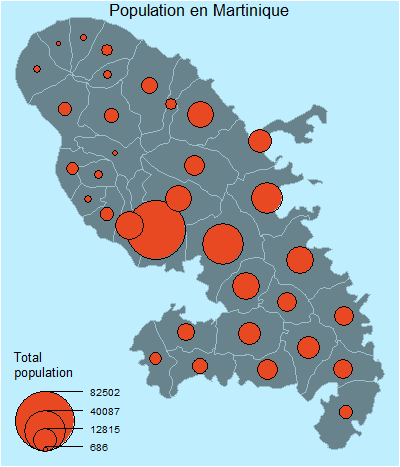

```{r setup, include=FALSE}
knitr::opts_chunk$set(echo = TRUE, message = F)
require(pacman)
pacman::p_load(c("data.table","dplyr","knitr","sf","viridis","leaflet","plotly","RColorBrewer","mapproj","units","mapsf","cartography"), install = F, update = F, character.only = T)

```

# Dauphine 2023

## 1. Des données spatiales et temporelles

Les données climatiques peuvent être de différentes formes et selon les usages et les besoins, il faudra parfois les extrapoler avant de s'en servir.\
Ce cours n'abordera pas la modélisation spatio-temporelles, toutefois un exemple de données de ce type pourra être manipulé.

Avant toute chose il est nécessaire de présenter les formats et outils des données spatiales. En traitement spatial / cartographique (SIG - Système d'Information Géographique), il faut voir chaque donnée comme une couche (un calque). Ces données pouvant se superposer ou contenir des détails (attributs) permettant de les typer et les comprendre. La jointure entre 2 couches se fait via une superposition spatiale et non par une clé unique.  

{height="600"}


### 1.0 Toute carte est fausse

Grande nouvelle : "LA TERRE EST RONDE !!!!"

Une carte sert à représenter des données issues d'un espace à 3 dimensions dans un espace qui n'en contient que 2.\
La cartographie est une science ancienne, qui a été révolutionné par l'aire de l'informatique. Il est à présent possible de stocker de la donnée spatiale... Les sciences de l'informatique géographique sont connues sous le nom de **Géomatique**.

Le nom des techniques permettant de réaliser le changement de dimensions est la **projection**, il en existe plusieurs types, selon ce que l'auteur souhaite réaliser. Une carte aura donc un parti pris.

Les codes et normes des différentes projections font partis d'un système de coordonnées mondiale : [EPSG](https://epsg.io/)

La projection mondiale la plus connue est la projection de **Mercator** (du mathématicien et cartographe éponyme). Pour être exact, la projection **pseudo-Mercator** utilisée par Google Maps est très certainement la projection la plus connue.

{height="400"}

Vous êtes vous déjà posé la question : *le Groenland est-il si grand que cela ?*

{height="400"}

```{r carto}
# 1 - Charger une carte du Groenland
map("world",regions = "Greenland")
map("world",regions = "Greenland",proj = 'azequalarea')
map("world",regions = "Greenland",proj = 'azequidistant')

# 2 - Faire d'autres tests : USA
map("usa")
map("usa",proj = 'azequalarea')
map("usa",proj = 'azequidistant')
```

```{r Groenland}
# 1 - Charger une carte du Groenland (préalablement téléchargée sur internet, cf. cours)
G_sf <- st_read("./data/sd368wz2435.shp")
class(G_sf)
head(G_sf)
names(G_sf)
# Représentation cartographique (choroLayer / typoLayer)
cartography::typoLayer(G_sf,var = "popsqkm")

# 2 - Calcule d'indicateurs sur le pays à partir des polygones :
# Surface en km² :
print(paste0("La superficie calculée du Groenland est de ",round(set_units(st_area(G_sf),"km^2"),0),
             " km², toutefois, les mesures officielles sont de ",G_sf$sqkm, "km²"))

# L'écart vient du système de porrection et/ou de la qualité de la carte.
set_units(st_area(G_sf),"km^2")/set_units(G_sf$sqkm,"km^2")

```

### 1.1 Les données vectorielles

Les données spatiales vectorielles font références aux points, à la ligne et aux polygones. 

#### 1.1.a Les **Points**

Les **points** sont identifiés par des coordonnées à 2 dimensions (longitude et latitude) et pour un système de projection donné. Il s'agit par exemple de la localisation géographique d'une adresse (on parlera de géocodage des adresses) ou encore d'un lieu d'intérêt (point de vue, emplacement d'une station météorologique ou de mesure de débit d'une rivière...). C'est le niveau le plus simple.

Pour visualiser les points, le script suivant permet de télécharger et de mettre en forme les trajectoires des ouragans dans le bassin Atlantique Nord depuis 1851. 

```{r Points}
# 1 - Charger les données sur les ouragans du NHC : https://www.aoml.noaa.gov/hrd/hurdat/hurdat2.html 
source("./pgm/hurdat.R")
Atlantic <- data.table(get_hurdat("AL"))
# Description des données : https://www.aoml.noaa.gov/hrd/hurdat/hurdat2-format.pdf

# 2 - Nettoyage et mise en forme
Atlantic <- Atlantic[!is.na(DateTime)]
# On va créer des colonnes pour les couleurs à tracer, la catégorie et en fonction de l'intensité de l'évènement à chaque instant t matérialisé par un point
Atlantic <- Atlantic %>% mutate(color = as.factor(case_when(Status == 'HU' ~ 'red',
                                                 Status == 'TS' ~ 'orange',
                                                 Status == 'TD' ~ 'yellow',
                                                 TRUE ~ 'gray')), 
                               Categ = as.factor(case_when(Status == 'HU' ~ 'Huricane',
                                                           Status == 'TS' ~ 'Tropical Storm',
                                                           Status == 'TD' ~ 'Tropical Depression',
                                                           TRUE ~ 'Other')),
                               intensity = as.factor(case_when(Status == 'HU' ~ paste0('Hurricane: ',
                                                        case_when(Atlantic$Wind >= 137 ~ 'Cat5',
                                                                  (Atlantic$Wind >= 113 & Atlantic$Wind < 137) ~ 'Cat4',
                                                                  (Atlantic$Wind >=  96 & Atlantic$Wind < 113) ~ 'Cat3',
                                                                  (Atlantic$Wind >=  83 & Atlantic$Wind <  96) ~ 'Cat2',
                                                                  (Atlantic$Wind >=  64 & Atlantic$Wind <  83) ~ 'Cat1')),
                                                     Status == 'TS' ~ 'Tropical Storm', 
                                                     Status == 'TD' ~ 'Tropical Depression',
                                                     TRUE ~ 'Other')),
                               Year = as.numeric(year(DateTime)),
                               Month = as.numeric(month(DateTime)),
                               TimePeriod10y = (paste0(as.character(round(Year-4.9,digits = -1)),"s")))

# 3 - Transformation en format spatial
# Les données de projection sont décalée sur la longitude, avant de transformer la base en données spatial il faut donc les corriger
Atlantic$Lon[Atlantic$Lon < -300] <- Atlantic$Lon[Atlantic$Lon < -300] + 360

# Rappel : https://epsg.io/4326 : projection de Mercator
AtlanticSF <- st_as_sf(Atlantic, coords = c("Lon","Lat"), crs = 4326)
# Visualiser les points 
# plot(AtlanticSF["intensity"])


```


#### 1.1.b Les **lignes**

Les **lignes** sont des points reliés entre eux et ne formant pas un chemin clos, on parlerait sinon de *polygones*.
Si l'on revient à nos ouragans, l'exercice suivant consiste à relier entre eux les points, par système, pour former des lignes de trajectoire.


```{r Lignes}
# 1 - Les fonctions de SF pour créer des lignes (ou des multi-lignes)
tst <- AtlanticSF %>% 
  group_by(Key) %>%
  summarise(do_union = FALSE) %>%
  st_cast("LINESTRING")
  
# 2 - Nettoyage : certains systèmes n'ont qu'on point et ce type de géométrie n'est pas comaptible avec les lignes... 
rmv <- Atlantic[,list(points = length(DateTime)), by = list(Key)][points == 1]

tst <- tst[!(tst$Key %in% rmv$Key),]
plot(st_geometry(tst))


```


#### 1.1.c Les **polygones**

Les **polygones** sont des lignes reliées entre elles et formant un chemin clos, cela peut correspondre notamment aux contours d'une île.  
L'étape suivante consiste à récupérer et tracer la Martinique (car les données sont simple d'accès).  
Dans un second temps nous pourrons travailler sur une carte dynamique pour mieux visualiser les résultats.  
Pour réaliser les cartes il est nécessaire de récupérer les fonds de cartes, certains peuvent être disponibles directement dans les données de R (et de ses librairies), à défaut des cartes par département sont disponible sur [data.gouv](https://www.data.gouv.fr/en/datasets/carte-des-departements-2-1/)


```{r polygones}
# 1 - Charger les données de la Martinique (disponible aussi dans Cartography)
mtq <- mapsf::mf_get_mtq()
plot(st_geometry(mtq), main = "Martinique")

# 2 - Leaflet et les cartes dynamiques
# Conversion de la carte dans un format compatible avec les carte leaflet (Mercator)
mtq2 <- mtq %>% sf::st_transform('+proj=longlat +datum=WGS84')
# Appel de l'application leaflet, ajout des tuiles de fonds (par défat OSM) et des polygones de la Martinique, en rouge
leaflet(mtq2, height = "500") %>% addTiles() %>% addPolygons(color = "red")

# 3 - Leaflet et lignes :
leaflet(mtq2, height = "500") %>% addTiles() %>% addPolylines(data = tst) %>% addPolygons(color = "red")


```

Ces cartes permettant d'empiler les données nous permettent d'envisager un comptage des systèmes ayant traversé la Martinique depuis 1851...  


### 1.2 Les opérations basiques sur les données vectorielles

Une fois les données récupérées et chargées ou mises en carte, il est possible d'effectuer des opérations avec.
Notamment avec les polygones, pour les regrouper, par exemple...

```{r vect_base}


# 1 - Calcul d'un centroïde de chaque polygone (peut servir pour une jointure spatiale)
mtq_c <- st_centroid(mtq)
plot(st_geometry(mtq))
plot(st_geometry(mtq_c), add=TRUE, cex=1.2, col="red", pch=20)

# 2 - calcul d'une matrice de distance 
mat <- st_distance(x=mtq_c,y=mtq_c)
mat[1:5,1:5]

# 3 - Agréger des polygones 
mtq_u <- st_union(mtq)
plot(st_geometry(mtq), col="lightblue")
plot(st_geometry(mtq_u), add=T, lwd=2, border = "red")

# 4 - Construire une zone tampon / un buffer 
mtq_b <- st_buffer(x = mtq_u, dist = 5000)
plot(st_geometry(mtq), col="lightblue")
plot(st_geometry(mtq_u), add=T, lwd=2)
plot(st_geometry(mtq_b), add=T, lwd=2, border = "red")

# 5 - Réaliser une intersection
m <- rbind(c(700015,1624212), c(700015,1641586), c(719127,1641586), c(719127,1624212), c(700015,1624212))
p <- st_sf(st_sfc(st_polygon(list(m))), crs = st_crs(mtq))
plot(st_geometry(mtq))
plot(p, border="red", lwd=2, add=T)
mtq_z <- st_intersection(x = mtq, y = p)
plot(st_geometry(mtq))
plot(st_geometry(mtq_z), col="red", border="green", add=T)

# 6 les polygones de Voronoi 
mtq_v <- st_voronoi(x = st_union(mtq_c))
mtq_v <- st_intersection(st_cast(mtq_v), st_union(mtq))
mtq_v <- st_join(x = st_sf(mtq_v), y = mtq_c, join=st_intersects)
mtq_v <- st_cast(mtq_v, "MULTIPOLYGON")
plot(st_geometry(mtq_v), col='lightblue')


```

Les **polygones de Thiessen ou de Voronoï** sont des polygones formant un pavage intégral dans lequel chaque point est entouré par un espace (une « cellule ») comprenant tous les points plus proches de ce point que d'un autre. Fondamentaux en modélisation spatiale, leur usage est devenu plus courant en géographie à mesure que les outils de calcul informatique se sont démocratisés. « Dans un réseau parfait de centres équipotents, les polygones de Thiessen sont des hexagones », précise Roger Brunet (2017), ce qui renvoie à la théorie des lieux centraux.  

C'est une façon de découper un territoire à partir de points. Par exemple si vous disposez de 600 points de mesure du vent en France (à un instant t), vous pouvez découper la France en polygones de Voronoi, puis calculer dans chaque polygone une estimation des vitesses du vent au sein de chaque polygone et cela en fonction des points le constituant. 

```{r cartography}
# save map
png(filename = "./data/map1.png", width = 400, height = 467, res = 100)
# ser margins
par(mar=c(0,0,0,0))
# Countries plot
plot(st_geometry(mtq), col = "lightblue4",
     border = "lightblue3", bg = "lightblue1")
# Population plot on proportional symbols
propSymbolsLayer(x = mtq, 
                 var = "POP", 
                 legend.title.txt = "Total\npopulation")
# Title
mtext(text = "Population en Martinique", side = 3, line = -1)
dev.off()
```
On peut à présent utiliser l'image :
 


### 1.3 Les données Raster 

Les données spatiales de type Raster sont assimilables à des images ou à des matrices. En d'autres termes ce sont des grilles espacées spatialement et comportant à chaque noud ou intersection une ou plusieurs informations. Visuellement ces éléments peuvent être représentés comme des images.

La définition du raster et sa projection géographique permettant de connaître l'espacement de ce maillage.  
Un raster peut se composer de plusieurs couches (les images en ont 3) et chaque couche portera une information.  

Certains format de données prennent également en charge la temporalité, ainsi il est possible qu'une couche d'un raster comporte l'axe temporel.  


Les scripts suivant vous sont donnés afin de visualiser ce que sont les raster, ce cours ne les utilisera pas.  
De plus, quelques scripts permettent de traiter les données du CMIP de projections climatiques, dans le passé (afin de valider ces projections) et surtout dans le futur selon les différents scénarios présentés dans les publications du GIEC.  

Vous trouverez notamment un script permettant de transformer les composantes u et v du vent (cf. cours) puis de filtrer les périodes temporelles pendant lesquels nous détections des vents moyens correspondant, à minima, à une tempête tropicale. Cette méthode s'inspire du mémoire d'actuariat cité dans le support du cours et s'arrête uniquement à l'identification, elle ne réalise ni le comptage indépendant ni la constitution des traces.

```{r raster}

```


# TP n°2 : Identification des systèmes cyclonique ayant approché les Antilles Françaises

L'objectif de ce TP est d'isoler les systèmes ayant traversé l'arc Antillais à proximité de nos îles, de les dénombrer selon leur intensité et si possible de calculer une période de retour, par intensité, de ces phénomènes.   

Pour simplifier le calcul nous prendrons 3 points (centroïdes) pour représenter les îles de la Martinique, la Guadeloupe et de St Martin (et St Barthélémy). Cette étape a déja été réalisée. 

Pour la première sélection, il est recommandé de comptabiliser les systèmes approchant à moins de 100km de ces points.
Une fois les trajectoires sélectionnées, il faudra les catégoriser, par exemple avec le point le plus proche de nos îles pour chaque trajectoire.
Enfin et si le temps le permet, une méthode permettant de passer de ce comptage à l'estimation des périodes de retour pourra être rappelé (n'hésitez pas à proposer vos idées).


```{r TP}
# 0 - Les Antilles françaises
df <- as.data.frame(list(Ile = c("St Martin","Guadeloupe","Martinique"),
                     lon = c(-63.1,-61.5,-61), lat = c(18.05,16.25,14.6)))

# 1 - ?

```


